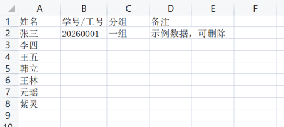

# 点名器（Roll Call）
> 本项目完全由Cursor开发而成，未进行任何人工干预。

一个基于 Vite + React + TypeScript 的本地点名小工具，支持导入 / 导出 Excel 名单、配置点名策略和查看点名记录。应用界面如下：


## 功能概览

- **导出 Excel 名单模板**：一键生成包含示例数据的 `xlsx` 模板。
- **导入名单 Excel 文件**：解析第一个工作表的前四列（姓名、学号/工号、分组、备注）。
- **点名策略**：
  - 完全随机；
  - 按名单轮流；
  - 随机且不重复（轮完一轮后重新开始）。
- **炫酷点名特效**：开始点名时有渐变光效与姓名跳动动画。
- **最近导入记录**：在本机 `localStorage` 中保存最近 5 次导入的名单元信息（名称、人数、时间）。
- **点名历史**：记录最近若干次点名结果（姓名、分组、时间等）。

> 当前示例应用仅在会话内保存完整名单数据，刷新页面后需重新导入名单。

## 安装与运行（仅前端调试）

```bash
cd ./Roll-Caller
npm install
npm run dev
```

然后在浏览器中访问命令行输出的地址（通常为 `http://localhost:5173`）。

## 打包为 Windows 安装包（推荐给小白使用）

1. 确保已安装 **Node.js 18+**（只需要在你这台开发机安装一次，小白用户不需要）。

2. 在项目目录中安装依赖：

   ```bash
   cd ./Roll-Caller
   npm install
   ```

3. 开发调试桌面版（Electron 窗口）：

   ```bash
   npm run electron:dev
   ```

4. 构建 Windows 安装包：

   ```bash
   npm run electron:build
   ```

   构建完成后，控制台会提示输出路径，一般会在 `dist` 相关目录下生成一个类似：

   `Roll-Caller-1.0.0.exe`

5. 我已经将本地编译出的exe文件传到Release中，需要请自行取用。

## 名单 Excel 模板格式

导出的模板第一个工作表为：

1. 第 1 行：表头，依次为：姓名、学号/工号、分组、备注；
2. 第 2 行：示例数据，可自行删除；
3. 从第 2 行起，每一行代表一位成员，至少需要填写姓名。(表格示例如下)



只要满足上述列顺序即可，其余样式不做限制。

